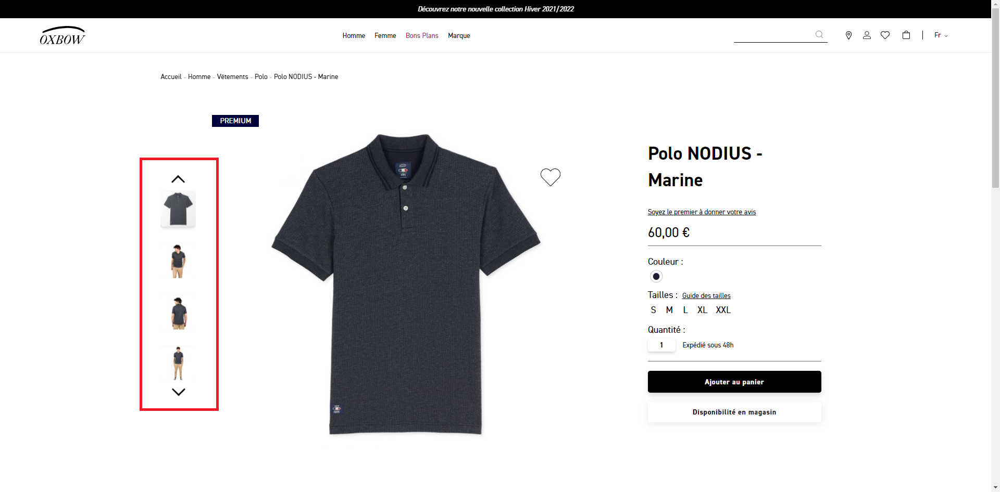
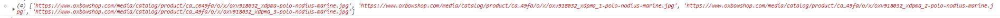
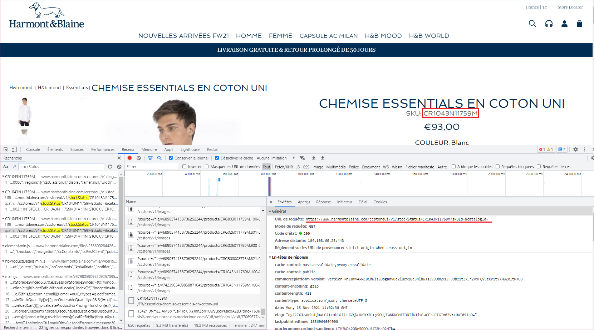
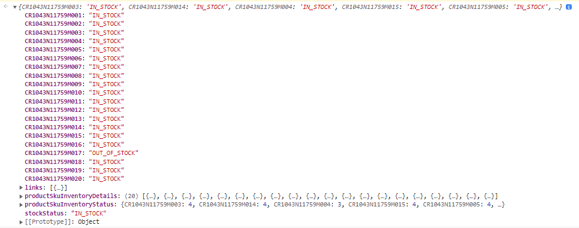
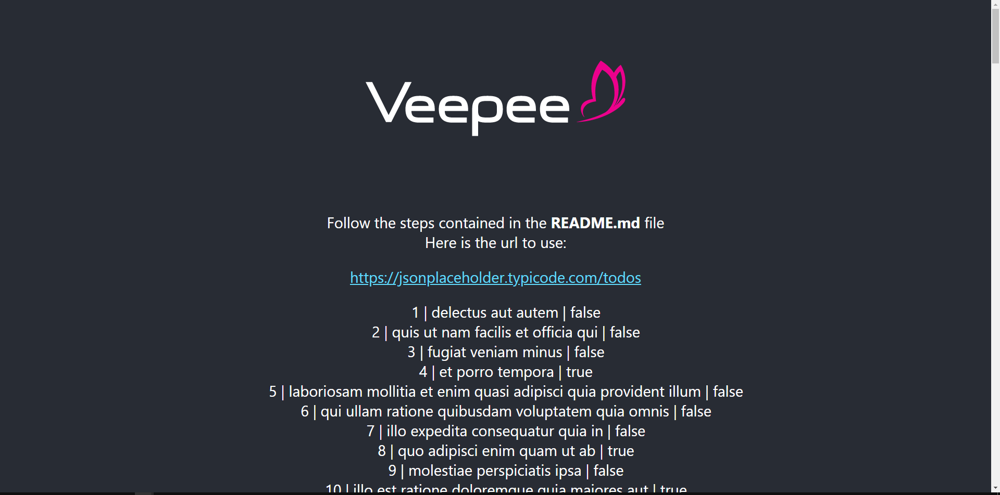

# l4nd1ng-f3tch

## Todo 1
----
Go to Oxbow product url [Polo NODIUS - Marine](https://www.oxbowshop.com/fr/n2nodius-deep-marine.html).

**Goal:** is to store in an array the list of pictures urls as a string from the images above in the red box and display it inside the browser development console.

The result should look something like this: 

***Hint:*** You can use `document.querySelector` or `document.querySelectorAll` it will return the first element (with `querySelector`) or an array of elements (with `querySelectorAll`) within the document that mathes the specified selector.

## Todo 2
----
Go to Harmont & Blaine product url [Chemise essentials en coton uni](https://www.harmontblaine.com/FR/essentials/chemise-essentials-en-coton-uni/CR1043N11759M).

**Goal:** is to request this API endpoint `https://www.harmontblaine.com/ccstoreui/v1/stockStatus/<DYNAMIC_SKU>?skuId=&catalogId=`, extract the json which will be stored in a constant and display it in the browser development console. To make the request we will have to retrieve the product sku in order to inject it in the url instead of `<DYNAMIC_SKU>`

The result should look something like this:

***Hint:*** You can use `XMLHttpRequest` or `Ajax` or `fetch`.

## Todo 3
----

### Install

**Prerequisites:** 
      
    Node >= 14.0.0 and npm >= 5.6

**Goal:** Create a component in an existing react project to fetch a json endpoint, for this you will need:
* Clone the repository `https://github.com/Snoobie/l4nd1ng-f3tch`
* Install dependencies and run React app
* Create a stateless component using the constant url in `App.js` file
* In this component you will have to make a request to the precedent url endpoint
* Render it in `ul, li` html element
* Add some style by removing bullets from lists

The result should look something like this:

